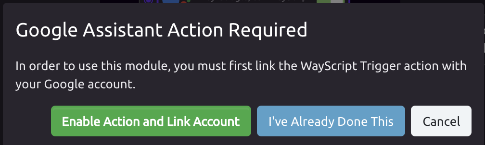
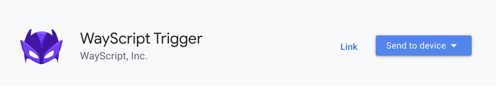
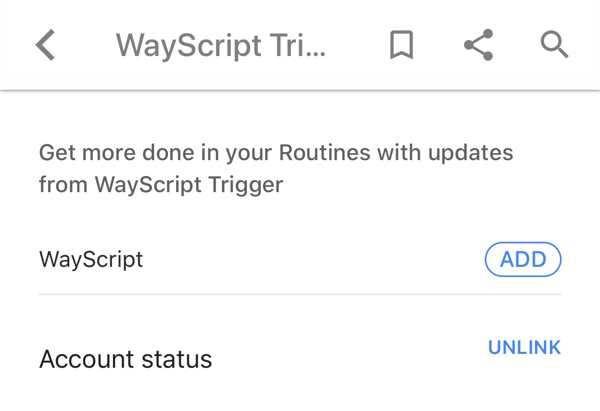
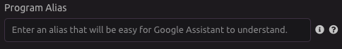
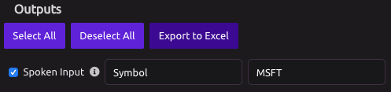
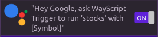

# Google Assistant Trigger


To have your Google Assistant speak a phrase, use the [Google Assistant module](../modules/google-assistant.md).‌


## ​ ⚙ Setup 

### ​ Enable Google Assistant 

Add the WayScript action to your Google Assistant account. 

1\) [Click here to go to the WayScript Trigger Google Assistant action](https://assistant.google.com/u/0/services/a/uid/000000dfb9940d69?hl=en-US&source=docs), or click "Enable Action and Link Account" in the modal presented when "Add an Account..." is selected in the Google Assistant Trigger.

2\) Click "Link" on the WayScript Trigger action page, or send the link to your device and click "Link" from the Google Assistant app.

3\) You will be taken to WayScript and prompted to sign in.

4\) Sign in and that's it! Your Google Assistant account is now linked!


If you wish to unlink WayScript from your account, click "Unlink" from the WayScript Trigger page in the Google Assistant app.

 


### ​ 🕵 Program Alias 

You can supply an easy-to-understand alias for your program.

Useful when your program name is long or difficult for the Google Assistant to understand‌

## ​ 🗣 Voice Commands 

### ​➡ Pass in Spoken Input 

To pass the input in your voice command, add "with \[Variable Value\]" to your Google Assistant phrase.‌

You can pass an argument to your Google Assistant-Triggered program by enabling the "Spoken Input" variable in the Outputs panel.

Suppose your program is called 'Stocks' and takes a single input called \[Symbol\] as input, you could then speak the following phrase to the Google Assistant:

> "Hey Google, ask WayScript Trigger to run 'Stocks' with AAPL."

### ​💬 Speak a Phrase 

Once you have added the Google Assistant Trigger to a program, you can include the [Google Assistant module](../modules/google-assistant.md), which will allow the Google Assistant to speak to you while your program is running.‌

You can reference variables that were created earlier in the program and insert them into an Google Assistant Phrase. See the [Google Assistant module documentation](../modules/google-assistant.md) for more details.‌

## 🎓 Tutorial

For a brief tutorial on how to use the Google Assistant Trigger, see [Run a Python Script with a Google Assistant Voice Command.](https://wayscript.com/blog_entry/44)

