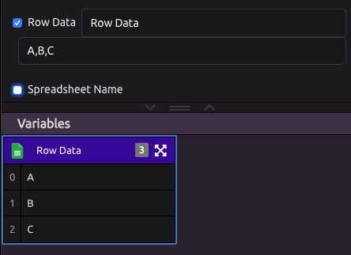

# Google Sheets Trigger


To read and write to Google Sheets, use the [Google Sheets module](../modules/google-sheets.md).


## 🔗 Link Your Google Account

In order to use the Google Sheets Trigger, you must first link your Google account.


You can add additional accounts from the Google Sheets Trigger settings.


## ⚙ Settings

### ⚡ Choose a Trigger

Select what type of change to a Google Sheet will trigger your program:

* A new row is added to a worksheet
* A row is updated or a new row is added to a worksheet
* A new worksheet is added to a spreadsheet

###  Choose a Spreadsheet/Worksheet

Depending on what type of Google Sheets change you selected in the step above, you will need to choose a Spreadsheet and Worksheet.


If you do not see the spreadsheet you are looking for, click the refresh button.


## 📤 Outputs

If your selected change involves a row being added or updated, you will have the changed row's data available as an output.

Depending on the option you select, you may have the Spreadsheet or Worksheet Name available as an output.

#### Default Values

* **Row Data** - While building with the Google Sheets trigger, you are going to want sample data to work with. To do this, you can make a change in your google sheet that triggers the event. Alternatively, you can enter comma separated values into your default value. These values will represent the row data brought into your program. These values will be overwritten with real data when the program triggers. 
* **Spreadsheet Name -** The name of the spreadsheet you are using

#### **Columns**

If you are triggering your program based on a row being updated or a new row being added, each of you columns will appear as a unique variable. If you update your spreadsheet, just press the refresh button next to your Worksheet and the columns will update. 

