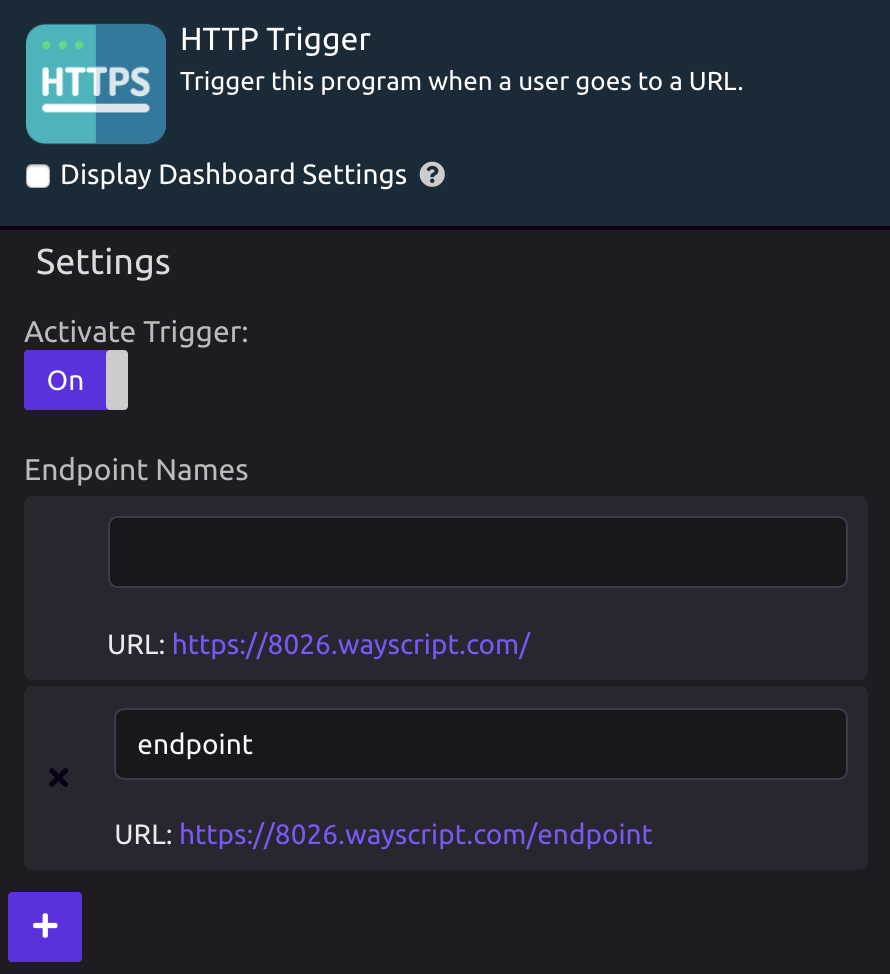

# HTTP Trigger


To display a webpage back to the user, use the [HTTP Response](../modules/http-response.md) module.


## ⚙ Setup

The HTTP Trigger is used to setup a web request. You can use it to implement a web page endpoint, a json post request, or other types of web requests.

To set up the HTTP Trigger, give your endpoint a name. You can also leave the field blank to match the root URL. You can add multiple endpoints.

To access the endpoint, use the program ID as a subdomain of wayscript.com. For example, in the image above, you could access this endpoint using https://8026.wayscript.com/endpoint.

Remember to Activate your trigger before using the endpoint.

## 🎓 Tutorial



