# Salesforce Trigger


To create, edit, and query Salesforce objects, use the [Salesforce Module](../modules/salesforce.md).


## ⚙ Setup

### 🔗 Link Your Salesforce Account

When you drag in a Salesforce Trigger for the first time, follow the prompt to authorize access.

### 🔑 API Access

First make sure you have API access enabled in Salesforce. To do this, follow [these instructions](https://ebstalimited.zendesk.com/hc/en-us/articles/229295368-How-do-I-enable-API-access-in-Salesforce).

##  New Object Created

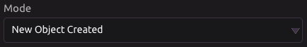

Run the program whenever a new Salesforce object is created.

### 🌟 New Account

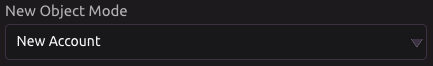


Program will run when a new account is created.


#### 📤 Outputs

* Account ID
  * Click [here](../modules/salesforce.md#object-ids) for more information about object IDs.
* Account Name
* Account Parent ID
  * Click [here](../modules/salesforce.md#object-ids) for more information about object IDs.
* Account Number
* Account Site
* Account Type
* Account Industry
* Account Annual Revenue
* Account Rating
* Account Phone
* Account Fax
* Account Website
* Account Ticker Symbol
* Account Ownership
* Account Employees
* Account SIC Code
* Account Billing Street
* Account Billing City
* Account Billing State
* Account Billing Zipcode
* Account Billing Country
* Account Shipping Street
* Account Shipping City
* Account Shipping State
* Account Shipping Zipcode
* Account Shipping Country
* Account Description
* JSON Data
  * Raw JSON data received from the API

### 📈 New Campaign

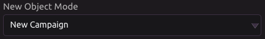


Program will run when a new campaign is created.


#### 📤 Outputs

* Campaign ID
  * Click [here](../modules/salesforce.md#object-ids) for more information about object IDs.
* Campaign Name
* Campaign Active
  * Indicates whether the campaign is currently active \(True/False\)
* Campaign Type
* Campaign Status
* Campaign Start Date
* Campaign End Date
* Campaign Expected Revenue
* Campaign Budgeted Cost
* Campaign Actual Cost
* Campaign Expected Response
* Campaign Num Sent
* Campaign Parent ID
  * Click [here](../modules/salesforce.md#object-ids) for more information about object IDs.
* Campaign Description
* JSON Data
  * Raw JSON data received from the API.

### 💼 New Case


Program will run when a new case is created.


#### 📤 Outputs

* Case ID
  *  Click [here](../modules/salesforce.md#object-ids) for more information about object IDs.
* Case Subject
* Case Status
* Case Origin
* Case Contact ID
  * Click [here](../modules/salesforce.md#object-ids) for more information about object IDs.
* Case Account ID
  * Click [here](../modules/salesforce.md#object-ids) for more information about object IDs.
* Case Type
* Case Reason
* Case Priority
* Case Web Email
* Case Web Name
* Case Web Company
* Case Web Phone
* Case Description
* JSON Data
  * Raw JSON data received from the API.

### 👤 New Contact

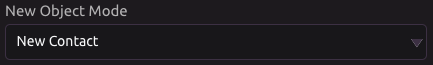


Program will run when a new contact is created.


#### 📤 Outputs

* Contact ID
  * Click [here](../modules/salesforce.md#object-ids) for more information about object IDs.
* Contact Name
* Contact Salutation
* Contact Account ID
  * Click [here](../modules/salesforce.md#object-ids) for more information about object IDs.
* Contact Title
* Contact Department
* Contact Birthdate
* Contact Reports To ID
  * Click [here](../modules/salesforce.md#object-ids) for more information about object IDs.
* Contact Lead Source
* Contact Phone
* Contact Home Phone
* Contact Mobile
* Contact Other Phone
* Contact Fax
* Contact Email
* Contact Assistant Name
* Contact Assistant Phone
* Contact Mailing Street
* Contact Mailing City
* Contact Mailing State
* Contact Mailing Zipcode
* Contact Mailing Country
* Contact Other Street
* Contact Other City
* Contact Other State
* Contact Other Zipcode
* Contact Other Country
* Contact Description
* JSON Data
  * Raw JSON data received from the API.

### 🗓 New Event

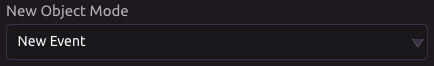


Program will run when a new event is created.


#### 📤 Outputs

* Event ID
  * Click [here](../modules/salesforce.md#object-ids) for more information about object IDs.
* Event Subject
* Event All Day
* Event Start Date/Time
* Event End Date/Time
* Event Location
* Event Name ID
  * Click [here](../modules/salesforce.md#object-ids) for more information about object IDs.
* Event Related To ID
  * Click [here](../modules/salesforce.md#object-ids) for more information about object IDs.
* Event Description
* JSON Data
  * Raw JSON data received from the API.

### 🕵 New Lead

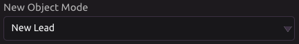


Program will run when a new lead is created.


#### 📤 Outputs

* Lead ID
  * Click [here](../modules/salesforce.md#object-ids) for more information about object IDs.
* Lead Name
* Lead Salutation
* Lead Status
* Lead Company
* Lead Title
* Lead Source
* Lead Industry
* Lead Annual Revenue
* Lead Phone
* Lead Mobile
* Lead Fax
* Lead Email
* Lead Website
* Lead Rating
* Lead No. of Employees
* Lead Street
* Lead City
* Lead State
* Lead Zipcode
* Lead Country
* Lead Description
* JSON Data
  * Raw JSON data received from the API.

### 🗒 New Note

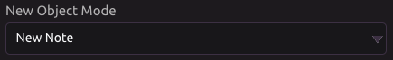


Program will run when a new note is created.


#### 📤 Outputs

* Note ID
  * Click [here](../modules/salesforce.md#object-ids) for more information about object IDs.
* Note Title
* Note Body
* Note Private
* Note Parent ID
  * Click [here](../modules/salesforce.md#object-ids) for more information about object IDs.
* JSON Data
  * Raw JSON data received from the API.

### ✨ New Opportunity

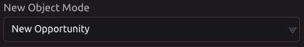


Program will run when a new opportunity is created.


#### 📤 Outputs

* Opportunity ID
  * Click [here](../modules/salesforce.md#object-ids) for more information about object IDs.
* Opportunity Private
* Opportunity Name
* Opportunity Close Date
* Opportunity Stage
* Opportunity Account ID
  * Click [here](../modules/salesforce.md#object-ids) for more information about object IDs.
* Opportunity Type
* Opportunity Lead Source
* Opportunity Amount
* Opportunity Next Step
* Opportunity Probability
* Opportunity Campaign ID
  * Click [here](../modules/salesforce.md#object-ids) for more information about object IDs.
* Opportunity Description
* JSON Data
  * Raw JSON data received from the API.

### 📋 New Task

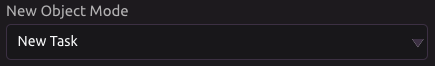


Program will run when a new task is created.


#### 📤 Outputs

* Task ID
  * Click [here](../modules/salesforce.md#object-ids) for more information about object IDs.
* Task Subject
* Task Due Date
* Task Priority
* Task Status
* Task Name ID
  * Click [here](../modules/salesforce.md#object-ids) for more information about object IDs.
* Task Related To ID
  * Click [here](../modules/salesforce.md#object-ids) for more information about object IDs.
* Task Description
* JSON Data
  * Raw JSON data received from the API.

##  Object Updated

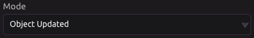

Run the program whenever a Salesforce object is updated.

### 📈 Campaign Updated

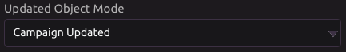


Program will run when a campaign is updated.


#### 📤 Outputs

* Campaign ID
  * Click [here](../modules/salesforce.md#object-ids) for more information about object IDs.
* Campaign Name
* Campaign Active
  * Indicates whether the campaign is currently active \(True/False\)
* Campaign Type
* Campaign Status
* Campaign Start Date
* Campaign End Date
* Campaign Expected Revenue
* Campaign Budgeted Cost
* Campaign Actual Cost
* Campaign Expected Response
* Campaign Num Sent
* Campaign Parent ID
  * Click [here](../modules/salesforce.md#object-ids) for more information about object IDs.
* Campaign Description
* JSON Data
  * Raw JSON data received from the API.

### 💼 Case Updated

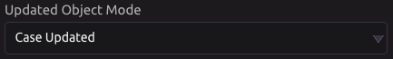


Program will run when a case is updated.


#### 📤 Outputs

* Case ID
  *  Click [here](../modules/salesforce.md#object-ids) for more information about object IDs.
* Case Subject
* Case Status
* Case Origin
* Case Contact ID
  * Click [here](../modules/salesforce.md#object-ids) for more information about object IDs.
* Case Account ID
  * Click [here](../modules/salesforce.md#object-ids) for more information about object IDs.
* Case Type
* Case Reason
* Case Priority
* Case Web Email
* Case Web Name
* Case Web Company
* Case Web Phone
* Case Description
* JSON Data
  * Raw JSON data received from the API.

### 🕵 Lead Updated

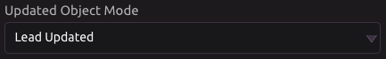


Program will run when a lead is updated.


#### 📤 Outputs

* Lead ID
  * Click [here](../modules/salesforce.md#object-ids) for more information about object IDs.
* Lead Name
* Lead Salutation
* Lead Status
* Lead Company
* Lead Title
* Lead Source
* Lead Industry
* Lead Annual Revenue
* Lead Phone
* Lead Mobile
* Lead Fax
* Lead Email
* Lead Website
* Lead Rating
* Lead No. of Employees
* Lead Street
* Lead City
* Lead State
* Lead Zipcode
* Lead Country
* Lead Description
* JSON Data
  * Raw JSON data received from the API.

### ✨ Opportunity Updated

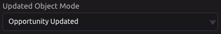


Program will run when an opportunity is updated.


#### 📤 Outputs

* Opportunity ID
  * Click [here](../modules/salesforce.md#object-ids) for more information about object IDs.
* Opportunity Private
* Opportunity Name
* Opportunity Close Date
* Opportunity Stage
* Opportunity Account ID
  * Click [here](../modules/salesforce.md#object-ids) for more information about object IDs.
* Opportunity Type
* Opportunity Lead Source
* Opportunity Amount
* Opportunity Next Step
* Opportunity Probability
* Opportunity Campaign ID
  * Click [here](../modules/salesforce.md#object-ids) for more information about object IDs.
* Opportunity Description
* JSON Data
  * Raw JSON data received from the API.

### 📋 Task Updated

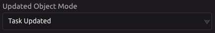


Program will run when a task is updated.


#### 📤 Outputs

* Task ID
  * Click [here](../modules/salesforce.md#object-ids) for more information about object IDs.
* Task Subject
* Task Due Date
* Task Priority
* Task Status
* Task Name ID
  * Click [here](../modules/salesforce.md#object-ids) for more information about object IDs.
* Task Related To ID
  * Click [here](../modules/salesforce.md#object-ids) for more information about object IDs.
* Task Description
* JSON Data
  * Raw JSON data received from the API.

