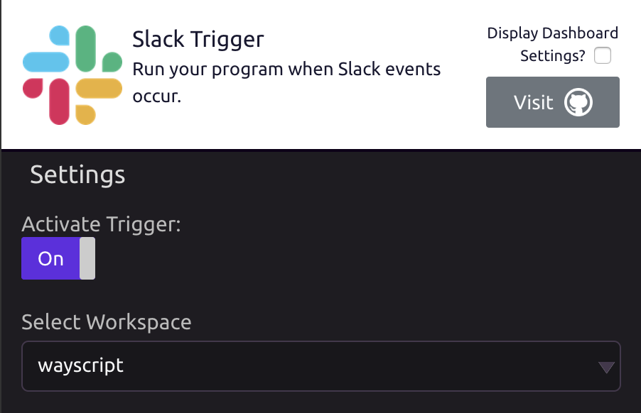
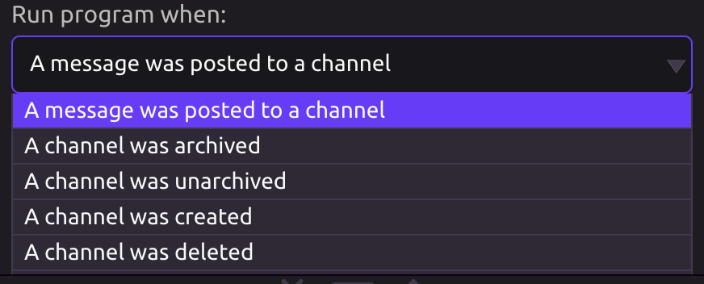
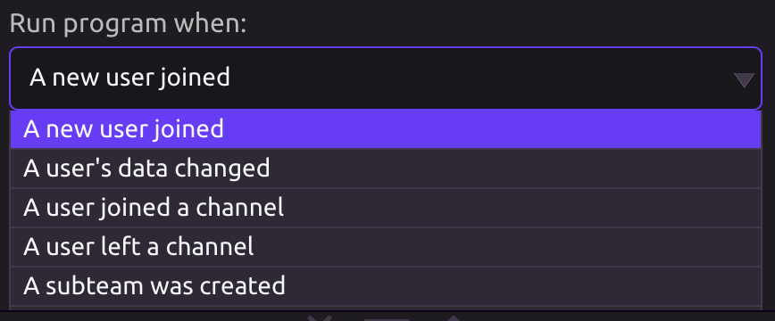
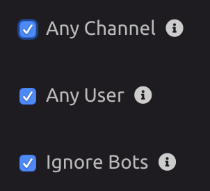
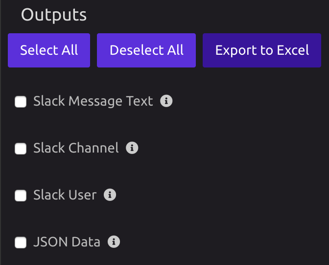

# Slack Trigger


To work with Slack channels and users, use the [Slack module](../modules/slack.md).


## 🔗Link Your Slack Account

When you drag in a Slack Trigger for the first time, follow the prompt to authorize access.

## ⚙Settings

### 💼Workspace

Select a linked workspace, or add a new one.

### ⚡Mode

Choose which event\(s\) will trigger your program

1. **Channel Events:** Monitor all or specified channels in your workspace.

   1. A message was posted to a channel
   2. A channel was archived
   3. A channel was unarchived
   4. A channel was created
   5. A channel was deleted
   6. A channel was renamed

      

2. **User Events:**

   1. A new user joined
   2. A user's data changed
   3. A user joined a channel
   4. A subteam was created
   5. A subteam was updated

    

You can scope the trigger to a specific channel and/or user, or allow the notification to fire for any channel and/or user.

Additionally, you can exclude messages from bots. 


Exclude messages from bots if you have a WayScript program that is posting as a bot to a channel that triggers the same WayScript program, so your WayScript program doesn't trigger itself.


## 📤Outputs

Select what event data you would like to retrieve as a program variable and set default values.

The Slack Channel, Slack User, and Raw JSON Data from the Slack event are always available as outputs.

If you chose the "message was posted to a channel" event type, the Slack Message Text will also be available.

