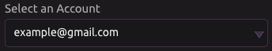
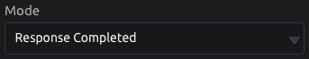
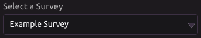

# Survey Monkey Trigger

## Settings

### Select an Account

This is the email of the Survey Monkey account you have authorized. If you want to add another account select **Add an Account** from the drop-down menu.

### Select a Mode

There are two modes:

1. Response Completed - The program will run whenever a response to the survey is completed.
2. Response Updated - The program will run whenever a response to the survey is updated.

### Select a Survey

This drop-down menu is automatically populated with the surveys created by the selected Survey Monkey account.

### Survey Response Details

Check this box if you have a paid Survey Monkey account. By doing so, you will be able to access the answers to your survey as outputs. See the **View Response Details** scope at [https://developer.surveymonkey.com/api/v3/\#scopes](https://developer.surveymonkey.com/api/v3/#scopes) for more details.

## Outputs

* Survey answers
  * Must have a paid Survey Monkey account and have '[Get survey response details](survey-monkey-trigger.md#survey-response-details)' box checked.
* IP Address
  * IP Address the response was taken from.
* Date Created
  * Date the response was created.
* Date Modified
  * Date the response was last modified.
* Analyze URL
  * Weblink to the analyze page to view the response.
* JSON Data
  * Raw JSON data received from the API.

