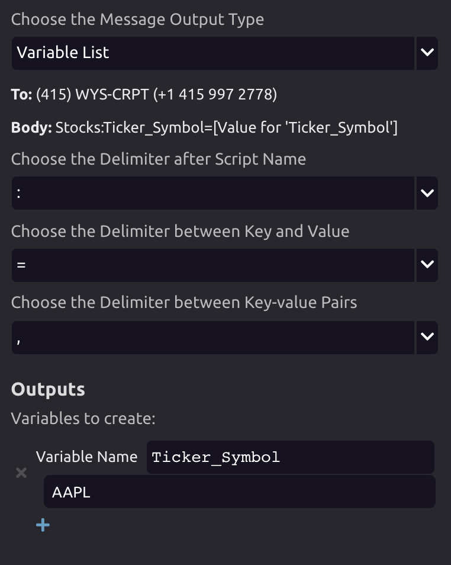
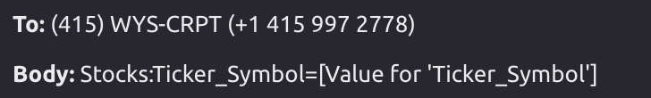

# Text Message Trigger


You can trigger WayScript programs to run by sending a text message to WayScript at  
**\(415\) WYS-CRPT**   \(+1 415 997 2778\)



To send text messages to yourself, use the [Text Message module](../modules/text-message.md).


## 📱 Phone Number Verification


If you haven't yet verified your phone number with your WayScript account, you will need to do so before using this module. See [Phone Number Verification](../../account-management/phone-number-verification.md) for details.


## ⚙Settings

### 📤Output Type

* Raw String
* Variables List

### ✂ Delimiter

* Symbols for separating arguments in the text message

### ✏ Output Variables

1. Specify variable's default value in the "Variables to Create" section. 
2. Dynamically update variable values into your program via text message. 

If you don't input a variable's value in the text message, the default value of that variable will be used. Otherwise, the variable's value in the text message will override the default value.

## 💬 Sending a Text

Send your text message to **\(415\) WYS-CRPT** \(+1 415 997 2778\).

The text message body should be in the format of :  **Program name**, followed by any variable **key-value pair**, with **delimiters of your choice**


The "Body" field in the Trigger Settings will also show you how to compose your message with your outputs variables and delimiter choices


In the above example, the text message should be sent in the format of:


The text must originate from your verified phone number.


