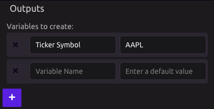
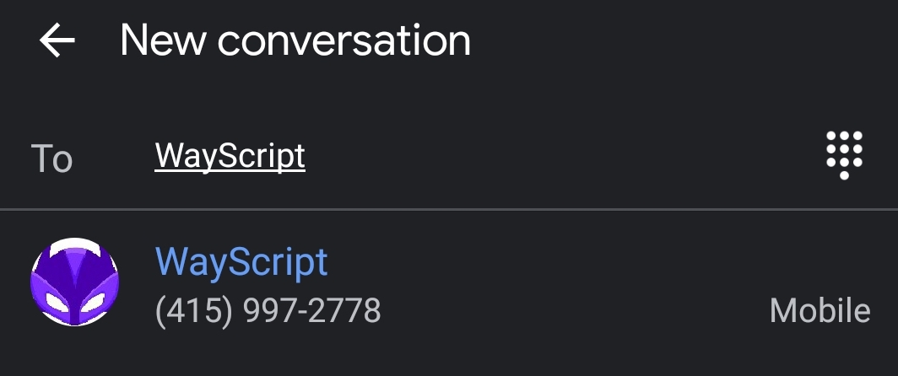
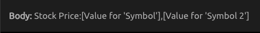

# Text Message Trigger


You can trigger WayScript programs to run by sending a text message to WayScript at  
**\(415\) WYS-CRPT**   \(+1 415 997 2778\)



To send text messages to yourself, use the [Text Message module](../modules/text-message.md).


## 📱 Phone Number Verification


If you haven't yet verified your phone number with your WayScript account, you will need to do so before using this module. See [Phone Number Verification](../../account-management/phone-number-verification.md) for details.


## 📥New Variable Inputs

You can dynamically input new variable data into your program via text message. Specify these variables in the "Variables to Create" section.

## 💬 Sending a Text

Send your text message to **\(415\) WYS-CRPT** \(+1 415 997 2778\).

The text message body will be the program name, followed by a colon, then any variable values, all separated by commas.

For example, if you wanted to run your "Stocks" program with the arguments "AAPL" and "MSFT", your message body would be "Stocks:AAPL,MSFT"


The "Body" field in the Trigger Settings will also show you how to compose your message



Variables must be submitted in the same order as the Outputs defined on the Text Message Trigger.



The text must originate from your verified phone number.


