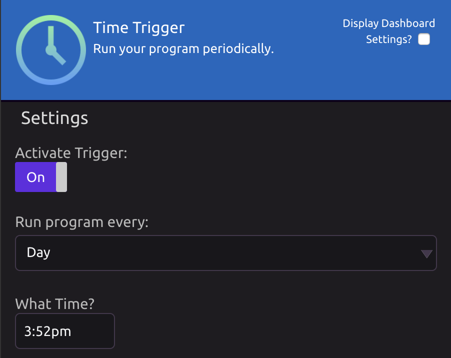
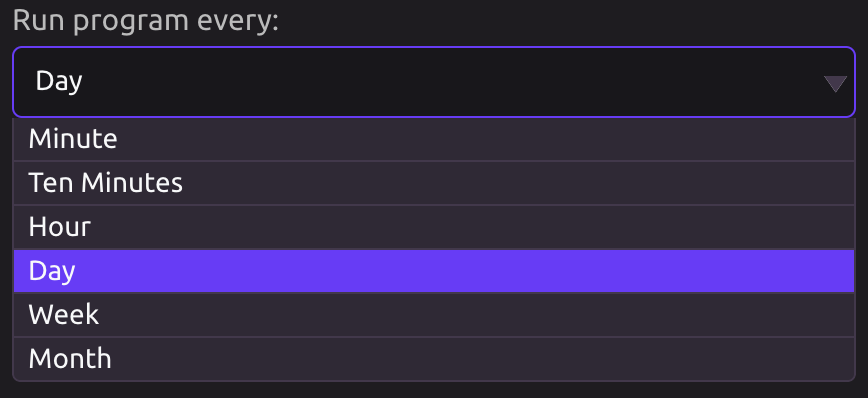

# Time Trigger

## ⚡ Activate the Time Trigger

In order to Trigger programs at a particular time, add the Trigger Module to the triggers section of your script and activate the trigger.

## 🗓 Select a Run Frequency

* Monthly
* Weekly
* Daily
* Hourly \(Premium feature\)
* Every ten minutes \(Premium feature\)
* Every minute \(Premium feature\)

If you select the **daily frequency**, you will have an option to choose what time your program should run each day.

If you select the **weekly frequency**, you will have an option to choose a day of the week and a time of day for your program to run.

If you select the **monthly frequency**, you will have an option to choose a day of the month and a time of day for your program to run.


If you select the 29th, 30th, or 31st, your program will not run on months with fewer than that number of days. **Use the "Last Day" option if you would like your program to run at the end of each month.**


