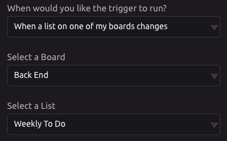
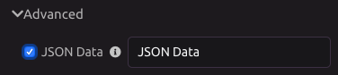

# Trello Trigger

## Link Your Trello Account

When you add a Trello Trigger to your program, you will be prompted to link an account if you have not done so already. 

## Event Types

Choose when you would like the trigger to run:

1. When one of my boards changes
2. When a list on one of my boards changes
3. When a specific card changes

## Outputs

Select which Trello event data to retrieve as program variables.

### Always Available

The following outputs are always available, regardless of event type:

* **Action Type** - The type of action that triggered the event
* **Action Date and Time** - The date and time that the event occurred
* **Changer Name** - The full name of the person who made the change
* **Changer Username** - The username of the person who made the change
* **Action Details** - JSON containing the details of the action that triggered the event
* **Board Name** - The name of the board you have selected
* **Board ID** - The ID of the board you have selected

### List Outputs

List change events produce the following additional outputs:

* **List Name** - The name of the list you have selected
* **List ID** - The ID of the list you have selected

### Card Outputs

Card change events produce the following additional outputs:

* **Card Name** - The name of the card you have selected
* **Card ID** - The ID of the card you have selected
* **Card Short ID** - The short form of the ID of the card you have selected
* **Card Description** - The description text for the card you have selected
* **Card Due Date** - The due date for the card you have selected
* **Card URL** - The URL for the card you have selected

### Advanced Outputs

In the advanced settings, you can choose to output the raw JSON data sent by Trello in the webhook event.

