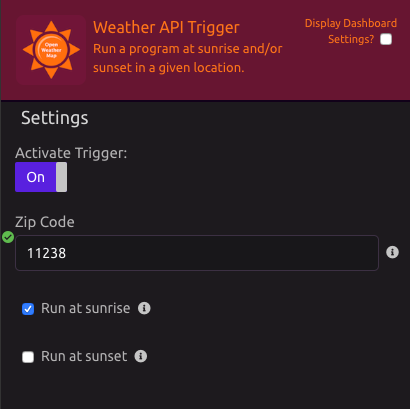

# Weather API Trigger


For current weather and forecasts in your city, use the [Weather API module](../modules/weather-api.md).


## ⚙ Setup

Enter your zip code, then select whether you want to run your WayScript program at sunrise, sunset, or both. 🌅 

