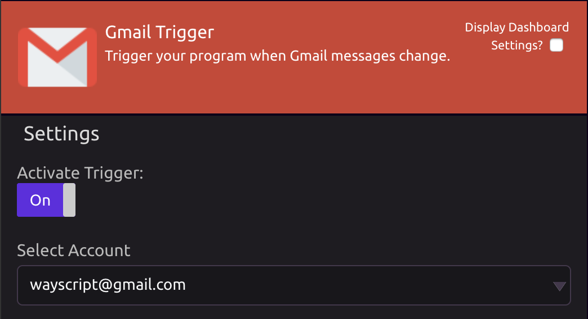
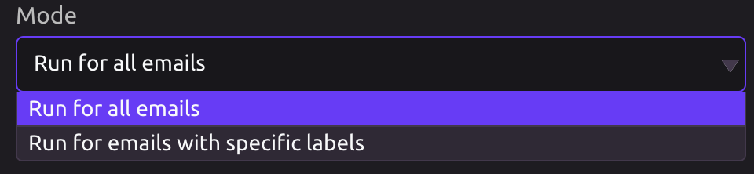
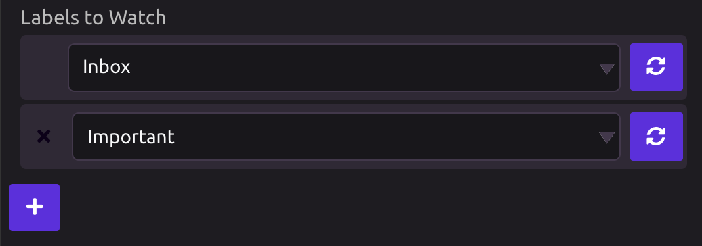

# Gmail Trigger

## Link Your Gmail Account

When you drag in a Gmail Trigger for the first time, follow the prompt to authorize access.


You can add additional accounts from the Gmail Trigger settings.


## Settings

### Modes

1. **Run for all emails:** All emails are evaluated.
2. **Run for emails with specific labels:** Only emails containing one of these labels will be evaluated.

### Activation Method

If "Run for emails with specific labels" is selected, you will then need to select which labels you want to watch.


If you do not see a label you are looking for, click the refresh button.


Choose which event\(s\) will activate the trigger.

* [ ] When one or more messages are received.
* [ ] When one or more messages are permanently deleted\( not Trashed \).
* [ ] When labels are added to a message.
* [ ] When labels are removed from a message.


The affected message\(s\) will be evaluated to create program variables. 


### Outputs

Select the data to retrieve as variables for your program.

* [ ] **Event Types** - For each message in the changeset, this will be one of the values "Received," "Changed," or "Deleted."
* [ ] **Message Ids -** The Id of each message in the changeset.
* [ ] **Thread Ids** - The Id of the thread to which each message in the changeset belongs.
* [ ] **Labels** - The labels that are currently present on the message.
* [ ] **Labels Added** - The labels that were added to the message during this change. \(Only applicable if the "When labels are added to a message" event is selected.\)
* [ ] **Labels Removed** - The labels that were removed from the message during this change. \(Only applicable if the "When labels are removed from a message" event is selected.\)
* [ ] **All Email Recipients** - All email addresses that received this message.
* [ ] **To Email Recipients** - Email addresses that were on the "To" line of the message.
* [ ] **Cc Email Recipients** - Email addresses that were on the "Cc" line of the message.
* [ ] **Senders** - The sender \("From" line\) of each message in the changeset.
* [ ] **Subjects** - The "Subject" line of each message in the changeset.
* [ ] **Body Snippets** - A preview of the body of each message in the changeset.
* [ ] **Dates** - Date/Time each message in the changeset was received.

