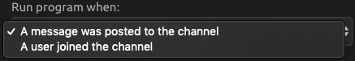
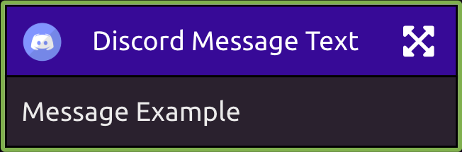

# Discord Trigger

## Link Your Discord Account

You can trigger WayScript programs to run when various Discord events occur.

In order to do this, you must first link your Discord account. Then, select the Discord Guild/Server you want to work with.

## Settings

### Choose when to run the program

Run program when:

* A message was posted to the channel
* A user joined the channel

### Choose a Channel

Choose a Discord channel to work with.


If you have recently added a channel and do not see it, click the refresh button.


## Outputs

The Discord User output will always be available.

If your trigger is set to run when "a message was posted to a channel," the Discord Message Text output will also be available.

