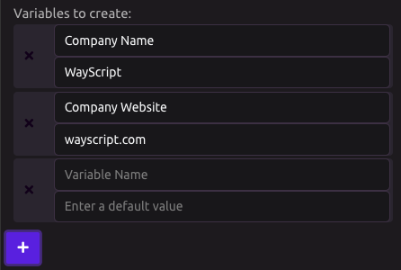

# Email Trigger

## Setup

### New Variable Inputs

You can dynamically input new variables into your WayScript programs from your email. You can assign these values under the Module Outputs.

## Sending an Email

Send your Email to: run@wayscript.com.

Email Subject: Program Name

Email Body: New variable values separated by commas.


* Variables must be submitted in the email in the same order as defined in the Module Outputs.
* Emails must come from the email address associated with your account \(the email you registered with\).



To prevent confusion, WayScript recommends never having the same name for multiple programs. 


